# Quant SMC

Quant SMC is a research-to-execution quantitative trading platform for crypto markets. It is built around a deterministic multi-timeframe feature graph, supervised specialist models, structured execution logic, and operator-facing telemetry. The system is designed so that research, backtest, forward test, live runtime, and dashboards all reason over the same `15m` decision spine with joined `1h`, `6h`, and `12h` context, rather than each runtime inventing its own version of market state.

This repository contains the repaired baseline of that platform: historical ingestion, feature engineering, label generation, model training, backtesting, forward simulation, live orchestration, a Streamlit research shell, and a `Next.js + FastAPI + WebSocket` operator terminal. The current tagged baseline is `v0.1.0`.

## Executive Summary

Quant SMC is not a single model and it is not a single dashboard. It is a layered decision system. Raw exchange data is normalized into canonical bars; canonical bars are transformed into engineered structural, statistical, and regime-aware features; those features are converted into supervised targets; specialist models and stackers are trained over those targets; runtime engines score new bars against the same feature contract; execution logic then combines gates, confluence, EVR, tiering, sizing, and trailing into a trade decision that can be inspected by an operator. The repo is therefore best understood as a full pipeline for building, validating, and operating a structured trading process.

The central design promise of the project is research-to-execution parity. The same market state representation should feed backtests, forward simulation, live operation, and operator telemetry. That is the reason for the multi-timeframe contract, the repaired feature builder, the governed label tuning path, the versioned model registry, and the telemetry layer that exposes decision reasoning rather than only final alerts.

## At A Glance

| Dimension | Current Baseline |
|---|---|
| Market focus | Crypto spot / derivatives-style directional trading logic |
| Primary asset launcher | `BTCUSD` |
| Exchange integration | Kraken historical fetch and streaming paths |
| Decision spine | `15m` |
| Higher-timeframe context | `1h`, `6h`, `12h` |
| Regime layer | `12h` HMM + HDBSCAN |
| Main supervised layer | tabular specialists + stackers |
| Forecast layer | quantile forecaster active, `NARX` deferred |
| Runtime modes | backtest, forward, live |
| UI surfaces | Streamlit research shell + Next terminal |
| Telemetry transport | FastAPI + WebSocket |
| Capital baseline | `20,000 USD` ticket policy with compounding and cooling |

## Table Of Contents

- [Executive Summary](#executive-summary)
- [At A Glance](#at-a-glance)
- [1. Project Purpose](#1-project-purpose)
- [2. What This System Actually Does](#2-what-this-system-actually-does)
- [3. Core Design Principles](#3-core-design-principles)
- [4. Timeframe Contract](#4-timeframe-contract)
- [5. End-To-End Architecture](#5-end-to-end-architecture)
- [6. Data Pipeline](#6-data-pipeline)
- [7. Feature Engineering](#7-feature-engineering)
- [8. Labeling And Supervised Targets](#8-labeling-and-supervised-targets)
- [9. Model Stack](#9-model-stack)
- [10. Execution, Risk, And Capital Logic](#10-execution-risk-and-capital-logic)
- [11. Runtime Modes](#11-runtime-modes)
- [12. Dashboards, Terminal, And Telemetry](#12-dashboards-terminal-and-telemetry)
- [13. Installation](#13-installation)
- [14. Environment And Secrets](#14-environment-and-secrets)
- [15. Main Entry Points](#15-main-entry-points)
- [16. BTCUSD Sequential Runbook](#16-btcusd-sequential-runbook)
- [17. Label Horizon Governance](#17-label-horizon-governance)
- [18. Expected Artifacts By Stage](#18-expected-artifacts-by-stage)
- [19. Project Layout](#19-project-layout)
- [20. Release Status And Current Caveats](#20-release-status-and-current-caveats)
- [21. Troubleshooting And Operator Notes](#21-troubleshooting-and-operator-notes)

## 1. Project Purpose

The goal of Quant SMC is not merely to generate trading alerts. The goal is to maintain a coherent, inspectable decision system in which structural market context, engineered statistical state, supervised probabilities, execution gates, risk controls, and operator visibility all agree on the same underlying market state. In practice that means the repo is designed around deterministic transformations: raw market data becomes canonical bars, canonical bars become engineered features, engineered features become labels and model inputs, and model outputs become auditable trade decisions.

The repo is oriented toward discretionary-quant and semi-automated operation rather than blind black-box execution. Decisions should be inspectable, reproducible, and decomposable. That is why the system includes confluence breakdowns, hazard scores, EVR logic, reasoning payloads, and terminal/dashboards that expose the internal decision state rather than just a buy/sell light.

## 2. What This System Actually Does

At a practical level, the system does the following:

| Layer | Function | Output |
|---|---|---|
| Data | Fetches Kraken market history or stream updates, normalizes bars, rebuilds timeframes | `1m`, `15m`, `1h`, `6h`, `12h` canonical bars |
| Features | Computes SMC structure, liquidity state, EMA state, volatility state, session state, regime context | Engineered `15m` decision frame |
| Labels | Turns forward market behavior into supervised targets | Specialist labels + hazard survival targets |
| ML | Trains specialist models, stackers, hazard models, and quantile forecasters | Versioned model registry artifacts |
| Execution | Applies gates, confluence, EVR, tiering, sizing, profit ladder, and hazard exits | Entries, runners, exits, risk actions |
| Runtime | Replays this logic in backtest, forward, and live modes | Consistent decision flow across environments |
| UI / Telemetry | Publishes decision state to Streamlit and Next terminal surfaces | Real-time operator visibility and auditability |

## 3. Core Design Principles

### Deterministic Research Parity

The same feature graph should feed research, backtest, forward test, and live runtime. This is the central anti-drift principle of the repository. The `15m` row that is scored by the model stack should carry the same higher-timeframe context and engineered features regardless of whether it came from historical CSVs, forward simulation, or live aggregation.

### Multi-Timeframe Role Separation

The repo is not intended to throw one undifferentiated model at a mixed bag of bars. Each timeframe has a specific job, and the system is more coherent because those responsibilities are separated rather than blurred.

### Structured Decision Making

The system does not directly map raw features to a single opaque trade score. It separates the logic into gates, specialist probabilities, confluence, EVR, tiering, sizing, and trailing. This makes the decision path more understandable and easier to audit.

### Governance Over Constant Mutation

Defaults are allowed to exist as stable production baselines. Tuning and challenger logic can improve those defaults, but the repo is moving toward governed promotion rather than uncontrolled runtime mutation.

## 4. Timeframe Contract

This repo is wired around a fixed timeframe contract:

| Timeframe | Role | Current Use |
|---|---|---|
| `12h` | Regime | HMM + HDBSCAN regime features and macro context |
| `6h` | Structure | Structural bias, premium/discount, compression, zone quality |
| `1h` | Flow | Flow readiness and impulse/follow-through context; dedicated `flow_1h` model |
| `15m` | Execution | Main engineered decision frame and supervised execution layer |
| `1m` | Plumbing | Raw ingestion and live aggregation source |

This separation matters because the models and labels are not meant to answer the same question at every timeframe. `12h` is asking whether the environment is supportive. `6h` is asking whether price is sitting in a structurally meaningful location. `1h` is asking whether flow is fresh enough to matter. `15m` is asking whether to act now.

## 5. End-To-End Architecture

### Architectural Flow

```mermaid
flowchart LR
    A[Kraken Historical Fetch / Live Stream] --> B[Canonical 1m Bars]
    B --> C[15m / 1h / 6h / 12h Rebuild]
    C --> D[Multi-Timeframe Feature Graph]
    D --> E[Label Builder]
    D --> F[Inference Frame]
    E --> G[Model Training]
    G --> H[Registry + Versioned Artifacts]
    H --> F
    F --> I[Gates + Confluence + EVR + Tiering]
    I --> J[Capital + Risk + Profit Ladder + Hazard]
    J --> K[Backtest / Forward / Live]
    K --> L[FastAPI + WebSocket Telemetry]
    L --> M[Next Terminal / Streamlit Research Shell]
```



The high-level system loop is:

1. Fetch or receive market data.
2. Normalize and store canonical bars.
3. Rebuild `15m`, `1h`, `6h`, and `12h`.
4. Engineer a `15m` decision frame with higher-timeframe context attached.
5. Generate forward-looking labels from the engineered frame.
6. Train specialist models and downstream stackers.
7. Score incoming decision rows.
8. Apply gates, confluence, EVR, and tiering.
9. Size positions using current capital/risk policy.
10. Manage exits using the profit ladder and hazard logic.
11. Publish everything to telemetry and dashboards.

## 6. Data Pipeline

### Historical Acquisition

For BTCUSD, the canonical top-level fetch script is:

```bash
python fetch_1m_BTCUSD_from_Kraken.py
```

This script is intentionally named for what it does. It is the correct manual starting point for a fresh BTCUSD pipeline run. It uses a Berlin-local default window:

- start: `2017-01-01 00:00:00 Europe/Berlin`
- end: yesterday `23:59:59 Europe/Berlin`

For shallow recent windows, the repo can use the standard Kraken OHLC path. For deep history, the fetch script automatically switches to the trades-backed bootstrap path because Kraken’s public OHLC endpoint does not provide years of reliable `1m` history.

### Checkpointing And Resume

The data layer is resumable. The current BTCUSD fetch path can persist and resume from canonical checkpoints rather than restarting from zero each time. For deep-history jobs, the fetch script also trims stale out-of-window data and rewinds checkpoints when necessary so the stored data remains aligned to the requested Berlin-local window.

### Timeframe Outputs

The fetch stage writes:

- `data/raw_1m/BTCUSD_1m.csv`
- `data/tf/BTCUSD_15m.csv`
- `data/tf/BTCUSD_1h.csv`
- `data/tf/BTCUSD_6h.csv`
- `data/tf/BTCUSD_12h.csv`

You do not need a separate manual resample step when using the top-level BTCUSD fetch script. The timeframe rebuild is part of that script.

## 7. Feature Engineering

### Why Features Matter

Training in this project is not meant to happen on raw exchange data. The model stack is designed to learn over engineered state, not over plain OHLC candles. That is why the feature engineering stage is a first-class step with its own launcher.

### Feature Launcher

```bash
python build_BTCUSD_features.py
```

This stage consumes the timeframe CSVs and produces the engineered `15m` feature frame used everywhere else.

### What The Feature Graph Contains

The engineered feature space includes:

| Family | Examples |
|---|---|
| SMC | swings, BOS, CHOCH, FVG, sweeps, zones |
| Structure context | structural bias, premium/discount, compression, zone score |
| EMA state | EMA distance, EMA relations, band regime |
| Volatility | ATR, realized vol, vol z-score, range percent |
| Liquidity | wick pressure, liquidity proximity, sweep strength, absorption proxies |
| Regime | `12h` regime state and regime probabilities |
| Session | session flags, session weights, market-hour context |
| Joined HTF state | `1h`, `6h`, and `12h` context projected onto the `15m` spine |

### Main Feature Artifact

The canonical BTCUSD feature output is:

- `artifacts/features/BTCUSD/BTCUSD_features.csv`

This file is the substrate for labels and downstream training.

## 8. Labeling And Supervised Targets

### Label Launcher

```bash
python build_BTCUSD_labels.py
```

This does not operate on raw bars. It operates on the engineered feature frame.

### What Labels Are Built

The canonical label builder creates these targets:

| Label | Purpose | High-Level Meaning |
|---|---|---|
| `label_liq_flow` | liquidity-flow specialist | did a sweep-led setup continue roughly `+1R` before invalidation? |
| `label_bos_cont` | BOS continuation specialist | did a BOS setup reach roughly `+3R` before invalidation? |
| `label_momo` | momentum specialist | did short-horizon forward return beat a noise-adjusted threshold? |
| `label_flow_1h` | `1h` flow specialist | did the current `1h` impulse context support follow-through? |
| `label_eop` | opportunity model | did a future high-opportunity setup appear within the horizon? |
| `label_edp` | danger model | did the market reach a significant drawdown condition? |
| `hazard_event`, `hazard_time` | hazard model | when does the first failure event happen, if at all? |

### Why These Labels Exist

They were chosen to match the actual questions the runtime asks:

- is this liquidity event worth trading?
- will this BOS continue?
- is `1h` flow sufficiently fresh?
- is momentum present?
- is upside opportunity forming?
- is downside danger increasing?
- how soon is failure likely?

These are not generic ML classes. They are trade-behavior labels expressed in the same language the execution engine uses: continuation, invalidation, `R`-multiples, drawdown, and event timing.

### Defaults vs Tuned Label Horizons

The current label horizons in `labels.yaml` are not random, but they are also not mathematically proven optimal. They are stable domain priors expressed in `15m` bars. The repo now supports empirical horizon tuning and governed promotion of better challenger profiles, described later in this README.

## 9. Model Stack

### Modeling Baseline

The current modeling contract is:

| Layer | Current Modeling Choice |
|---|---|
| `12h` regime | `HMM + HDBSCAN` |
| `6h` structure | deterministic context layer |
| `1h` flow | supervised tabular specialist |
| `15m` execution | supervised tabular specialists + stackers |
| auxiliary forecast | quantile forecaster now; `NARX` reserved for later soft use only |

### Training Contract

The trained models in this repository are not interchangeable generic classifiers. Each one exists to answer a specific trading question over a specific slice of the engineered state space. The correct way to reason about the stack is therefore model-by-model rather than as a single monolith.

| Model | Target | Feature Scope | Why It Exists | Main Runtime Use |
|---|---|---|---|---|
| `liq_flow` | `label_liq_flow` | `15m` execution row with joined HTF context | evaluate sweep/liquidity reaction quality | contributes to entry-quality assessment |
| `bos_cont` | `label_bos_cont` | `15m` execution row with joined HTF context | evaluate continuation after structural break | continuation confidence |
| `flow_1h` | `label_flow_1h` | `1h` flow features plus allowed `6h/12h` context | determine whether higher-timeframe impulse is fresh enough | flow readiness gating and ranking |
| `momo` | `label_momo` | `15m` execution row | capture short-horizon directional energy | execution timing and near-term momentum |
| `eop` | `label_eop` | `15m` execution row | estimate upside opportunity state | opportunity ranking and positive pressure |
| `edp` | `label_edp` | `15m` execution row | estimate downside danger state | danger awareness and de-risking context |
| `meta_model` | stack over specialists | specialist outputs | produce an integrated second-layer probability | downstream fusion input |
| `confluence_model` | stack over specialists and meta | specialist outputs + meta outputs | represent the final learned decision strength | primary ranked confluence score |
| `hazard` | `hazard_event`, `hazard_time` | `15m` execution row | estimate failure timing / exit risk | trailing, tightening, exit pressure |
| `quantile` | direct future return distribution | `15m` execution row | estimate tail behavior and distribution shape | EV context, runner logic, risk shaping |

### Specialist Models

The repo currently trains these specialist families:

- `liq_flow`
- `bos_cont`
- `flow_1h`
- `momo`
- `eop`
- `edp`

These are trained on the engineered `15m` decision frame, with the proper higher-timeframe feature scope already joined in.

### Downstream Models

On top of the specialist layer, the repo trains:

- `meta_model`
- `confluence_model`
- `hazard`
- `quantile`

`meta_model` and `confluence_model` are stackers. `hazard` models failure timing. `quantile` provides return-distribution shape for risk and runner logic.

### NARX Status

`NARX` remains outside the main runtime path. The agreed repo policy is:

- allowed later as a soft ranking / runner / moonshot enhancer
- not used as a hard guardrail
- not used for cooling triggers
- not used to override the main `12h/6h/1h/15m` decision stack

### Inference Contract

At inference time, the predictor is expected to return a structured output rather than a single scalar. The downstream execution layer expects specialist probabilities, meta probability, confluence probability, hazard shape, and quantile outputs in a schema-stable form. That is why model registry artifacts persist their feature lists and why the predictor reads those persisted feature contracts instead of guessing from column names at runtime.

## 10. Execution, Risk, And Capital Logic

### Decision Flow

The execution stack is layered:

1. higher-timeframe gates
2. confluence
3. EVR
4. tiering
5. sizing
6. entry
7. profit ladder
8. hazard trailing
9. cooling / reset logic

### Capital Policy

The current baseline is a ticket-based capital policy:

| Parameter | Current Default |
|---|---|
| starting equity | `20,000 USD` |
| base ticket | `20,000 USD` |
| compounding | enabled |
| cooling / vault reset | enabled |
| MPC | available but disabled by default |

This means the system compounds during healthy cycles, but it is designed to protect profits and cool down when danger signals intensify.

### Profit Ladder And Hazard

The repaired runtime now supports a more explicit trade-management structure:

- core/runner split
- profit ladder logic
- hazard-based trailing
- longer hold bias for stronger continuation conditions

## 11. Runtime Modes

### Backtest

Historical execution and analytics are under `quant_system/backtest/`. The core backtester is the authoritative historical runtime path.

Primary use:
- research validation
- trade distribution analysis
- equity curve and drawdown analysis
- replay exports and post-trade audit

### Forward Test

The forward runtime in `quant_system/forward_test/` mirrors live-style decisioning on new bars without placing real exchange orders.

Primary use:
- pre-production runtime validation
- model and execution parity checks
- dashboard and reasoning inspection under fresh incoming data

### Live

The live runtime in `quant_system/live/` mirrors the repaired forward logic and publishes structured telemetry. The transport architecture is moving toward a stricter shared event plane rather than independent console/UI logic.

Primary use:
- real-time alerting
- execution intent generation
- operator monitoring
- telemetry publishing to the terminal and research surfaces

## 12. Dashboards, Terminal, And Telemetry

### Streamlit Research Shell

The Streamlit layer remains the research, audit, and reporting surface:

```bash
streamlit run quant_system/dashboard/app.py
```

### Next Operator Terminal

The live operator UI is now a real frontend:

- `Next.js`
- `React`
- `Tailwind`
- `FastAPI + WebSocket` backend transport

Start backend:

```bash
python -m quant_system.cli.forward_cli --terminal-server
```

Start frontend:

```bash
cd frontend
npm run dev
```

### Terminal Domains

The terminal is organized into six domains:

1. `Mission Control`
2. `Insights`
3. `Regime Briefings`
4. `Signal Intelligence`
5. `Risk Radar`
6. `Research & Audit`

### Reasoning Payloads

Forward/live alerts carry structured reasoning built in [`forward_reasoning_attach.py`](./quant_system/forward_test/forward_reasoning_attach.py), including:

- `ml`
- `smc`
- `regime`
- `flow`
- `ema`
- `confluence_breakdown`
- `evr`
- `hazard`
- `final_decision`
- `session`

These can be inspected in both the Streamlit shell and the Next terminal.

## 13. Installation

### Prerequisites

The baseline environment assumes:

| Component | Recommended |
|---|---|
| Python | `3.11` |
| Node.js | `>= 20` |
| Package manager | `pip` and `npm` |
| Optional shell | `conda` recommended for isolation |
| OS | macOS or Linux-like environment |

### Python

```bash
conda create -n quant_smc python=3.11 -y
conda activate quant_smc
pip install -r requirements.txt
```

### Frontend

```bash
cd frontend
npm install
```

### Backend + Frontend Quick Start

Once models and artifacts exist, the normal operator startup flow is:

```bash
python -m quant_system.cli.forward_cli --terminal-server
cd frontend
npm run dev
```

Optional research shell:

```bash
streamlit run quant_system/dashboard/app.py
```

### Note About Local Python

The top-level BTCUSD launcher scripts now include a small bootstrap helper so they can recover if launched with the wrong Python binary. That helps when `pandas` or other repo dependencies are available in your conda Python but not in `/usr/bin/python3`.

## 14. Environment And Secrets

Create `.env` from [`.env.example`](./.env.example).

Important variables:

- `KRAKEN_API_KEY`
- `KRAKEN_API_SECRET`
- `QS_ENV=DEV`

Frontend env template:

- `QUANT_TERMINAL_API_URL=http://127.0.0.1:8100/snapshot`
- `NEXT_PUBLIC_TERMINAL_WS_URL=ws://127.0.0.1:8100/ws/terminal`

Do not commit exchange credentials. The config-local `secrets.env` is a sensitive file and should not be treated as safe for source control.

### Configuration Model

The configuration system merges a base config, module configs, overrides, and environment substitutions into one unified runtime config. In practical terms, that means:

1. `base.yaml` establishes the global baseline
2. module YAMLs under `quant_system/config/` fill in data, features, labels, models, execution, and observability
3. environment values can override placeholders
4. runtime components read the merged contract rather than one-off local files

This matters because the repo is trying to avoid per-script drift. Data, training, execution, and telemetry should all read the same resolved configuration model.

## 15. Main Entry Points

### Core CLIs

```bash
python -m quant_system.cli.train_cli
python -m quant_system.cli.backtest_cli
python -m quant_system.cli.forward_cli
python -m quant_system.cli.live_cli
python -m quant_system.cli.terminal_api_cli
```

### Terminal API Console Script

```bash
quant-terminal-api
```

### BTCUSD Manual Launchers

These are the human-friendly top-level scripts that make the pipeline explicit:

- `fetch_1m_BTCUSD_from_Kraken.py`
- `build_BTCUSD_features.py`
- `build_BTCUSD_labels.py`
- `train_BTCUSD_liq_flow_model.py`
- `train_BTCUSD_bos_cont_model.py`
- `train_BTCUSD_flow_1h_model.py`
- `train_BTCUSD_momo_model.py`
- `train_BTCUSD_eop_model.py`
- `train_BTCUSD_edp_model.py`
- `train_BTCUSD_meta_model.py`
- `train_BTCUSD_confluence_model.py`
- `train_BTCUSD_hazard_model.py`
- `train_BTCUSD_quantile_model.py`
- `tune_BTCUSD_label_horizons.py`

## 16. BTCUSD Sequential Runbook

### Overview

The cleanest manual workflow is:

1. fetch data
2. engineer features
3. build labels
4. train specialists
5. train stackers
6. train hazard and quantile layers

### Ordered Runbook

| Step | Run | What it does | Main outputs |
|---|---|---|---|
| 1 | `python fetch_1m_BTCUSD_from_Kraken.py` | Fetches BTCUSD history from Kraken using the Berlin-local window from `2017-01-01 00:00` through yesterday `23:59:59`. Deep history automatically uses trades bootstrap, then rebuilds canonical timeframe bars. | `data/raw_1m/BTCUSD_1m.csv`, `data/tf/BTCUSD_15m.csv`, `data/tf/BTCUSD_1h.csv`, `data/tf/BTCUSD_6h.csv`, `data/tf/BTCUSD_12h.csv` |
| 2 | `python build_BTCUSD_features.py` | Builds the engineered `15m` decision frame from the timeframe bars. | `artifacts/features/BTCUSD/BTCUSD_features.csv` |
| 3 | `python build_BTCUSD_labels.py` | Builds canonical labels from the engineered feature frame. | `artifacts/labels/BTCUSD/BTCUSD_labels.csv` |
| 4 | `python train_BTCUSD_liq_flow_model.py` | Trains the liquidity-flow specialist. | `artifacts/train/BTCUSD/liq_flow/` |
| 5 | `python train_BTCUSD_bos_cont_model.py` | Trains the BOS continuation specialist. | `artifacts/train/BTCUSD/bos_cont/` |
| 6 | `python train_BTCUSD_flow_1h_model.py` | Trains the `1h` flow specialist. | `artifacts/train/BTCUSD/flow_1h/` |
| 7 | `python train_BTCUSD_momo_model.py` | Trains the momentum specialist. | `artifacts/train/BTCUSD/momo/` |
| 8 | `python train_BTCUSD_eop_model.py` | Trains the opportunity specialist. | `artifacts/train/BTCUSD/eop/` |
| 9 | `python train_BTCUSD_edp_model.py` | Trains the downside-danger specialist. | `artifacts/train/BTCUSD/edp/` |
| 10 | `python train_BTCUSD_meta_model.py` | Trains the meta stacker over specialists. | `artifacts/train/BTCUSD/meta_model/` |
| 11 | `python train_BTCUSD_confluence_model.py` | Trains the confluence stacker. | `artifacts/train/BTCUSD/confluence_model/` |
| 12 | `python train_BTCUSD_hazard_model.py` | Trains the hazard timing layer. | `artifacts/train/BTCUSD/hazard/` |
| 13 | `python train_BTCUSD_quantile_model.py` | Trains the quantile forecaster. | `artifacts/train/BTCUSD/quantile/` |

### Recommended Interpretation Of The Sequence

This runbook is intentionally explicit. A professional workflow should make the dependency chain visible rather than hide it behind a single opaque command. The order matters because every downstream stage assumes a completed upstream contract:

- training assumes engineered features and labels already exist
- labels assume engineered features already exist
- engineered features assume canonical timeframe bars already exist
- runtime inference assumes versioned model artifacts already exist
- dashboards become meaningfully informative only after runtime and model artifacts exist

If a later stage fails, the right response is usually to inspect the expected outputs of the immediately previous stage rather than rerunning unrelated parts of the stack.

### Strict Sequence Warnings

| Step | Must already be completed | Warning |
|---|---|---|
| `build_BTCUSD_features.py` | fetch must be finished | do not run this before the timeframe CSVs exist |
| `build_BTCUSD_labels.py` | features must be finished | labels are derived from engineered states, not raw bars |
| specialist model launchers | fetch + features + labels must be finished | do not train from raw data only |
| `train_BTCUSD_meta_model.py` | specialist models should already exist | the meta model is not a first-stage model |
| `train_BTCUSD_confluence_model.py` | specialists and ideally `meta_model` should exist | confluence is the scored aggregation layer |
| `train_BTCUSD_hazard_model.py` | fetch + features + labels must be finished | hazard is a risk/exit layer, not a substitute for specialists |
| `train_BTCUSD_quantile_model.py` | fetch + features + labels must be finished | quantile is a distribution layer, not the main execution model |

### Minimum Safe Sequence

1. `python fetch_1m_BTCUSD_from_Kraken.py`
2. `python build_BTCUSD_features.py`
3. `python build_BTCUSD_labels.py`
4. train the specialist models you need
5. train `meta_model`
6. train `confluence_model`
7. train `hazard`
8. train `quantile`

## 17. Label Horizon Governance

### Why Governance Exists

The label horizons in `labels.yaml` are currently the production baseline, but they are not treated as sacred or permanently optimal. They are sensible starting values. The repo now includes an empirical challenger path so horizon choices can be tested, scored, and promoted without mutating production behavior on every run.

### Tuning Launcher

```bash
python tune_BTCUSD_label_horizons.py
```

### What It Does

The tuner:

1. loads the engineered BTCUSD feature frame
2. rebuilds candidate label sets for multiple horizon choices
3. includes the current default profile as the baseline
4. scores challengers empirically with a simple time-series CV baseline
5. compares challenger objective score vs baseline objective score
6. promotes only if the challenger clears the configured improvement threshold

### Promotion Behavior

The active promoted label profile is stored under:

- `artifacts/label_profiles/active_label_profile.json`

Historical promoted snapshots are stored under:

- `artifacts/label_profiles/history/`

When [LabelBuilder](/Users/mac/Documents/quant_smc/quant_system/label_generation/label_builder.py) runs, it now automatically checks for an active promoted profile and applies it on top of the defaults. That means:

- defaults remain the production baseline
- tuning can recommend challengers
- challengers can be promoted automatically
- future label builds can then use the promoted profile without hand-editing `labels.yaml`

### Important Constraint

This is governed promotion, not uncontrolled mutation. The intent is:

- tune periodically
- validate challengers
- promote only if better
- keep the promoted profile stable until the next research cycle

## 18. Expected Artifacts By Stage

| Stage | Expected artifacts |
|---|---|
| Fetch | `data/raw_1m/BTCUSD_1m.csv`, `data/tf/BTCUSD_15m.csv`, `data/tf/BTCUSD_1h.csv`, `data/tf/BTCUSD_6h.csv`, `data/tf/BTCUSD_12h.csv` |
| Features | `artifacts/features/BTCUSD/BTCUSD_features.csv` |
| Labels | `artifacts/labels/BTCUSD/BTCUSD_labels.csv` |
| Training | per-model `artifacts/train/BTCUSD/<model_name>/` manifests and registry artifacts |
| Label tuning | `artifacts/label_tuning/BTCUSD/` reports |
| Promoted labels | `artifacts/label_profiles/active_label_profile.json` |

If those expected files are missing, the correct move is usually to go back one stage rather than trying to force the next stage to run.

## 19. Project Layout

```text
quant_system/
  backtest/          historical execution, replay, reports
  cli/               train/backtest/forward/live/terminal entrypoints
  config/            YAML config system
  dashboard/         Streamlit research and audit dashboards
  data/              ingestion, prep, storage
  execution/         gating, confluence, EVR, risk, adapters
  features/          SMC, liquidity, EMA, volatility, regime features
  forward_test/      paper-forward runtime and dashboard bridge
  label_generation/  canonical labels, tuning, and profile governance
  live/              live orchestration and execution loop
  live_data/         streaming market data and replay
  ml/                training, prediction, registry, regime tooling
  model_ensemble/    optional ensemble governance
  model_switcher/    optional model selection layer
  models/            legacy wrappers + NARX module
  replay_export/     standalone replay export
  strategy/          pyramiding / trade management policy
  telemetry/         FastAPI + WebSocket terminal backend
frontend/            Next.js + Tailwind operator terminal
```

## 20. Release Status And Current Caveats

### Release Status

Current tagged baseline: `v0.1.0`

- release notes: [`CHANGELOG.md`](./CHANGELOG.md)
- repair summary: [`quant_smc_pipeline_report.md`](./quant_smc_pipeline_report.md)

### Current Caveats

- This repo still contains overlapping generations of code in some areas, even though the main runtime paths have been repaired.
- The fetch layer is correct for deep history, but full-history Kraken trades bootstrap can take a long time.
- Artifact fallback still exists in some surfaces, though the preferred live transport is now `FastAPI + WebSocket`.
- Default label horizons are baseline values, not mathematically guaranteed optima.
- `NARX` remains intentionally outside the main runtime path for now.

### Summary

This project is now best understood as a structured quant trading platform with:

- deterministic multi-timeframe feature parity
- specialist and stacked supervised models
- explicit execution and risk logic
- live operator telemetry
- governed tuning paths for key research assumptions

It is not just a signal script. It is an evolving decision system whose design intent is to make research, execution, and operator judgment coherent with each other rather than separate worlds.

## 21. Troubleshooting And Operator Notes

### The Fetch Script Shows A 2016 UTC Start When I Asked For 2017 Berlin

That is expected. `2017-01-01 00:00 Europe/Berlin` converts to `2016-12-31 23:00 UTC`. The fetch script logs both representations because Kraken requests are executed in UTC while the requested business boundary is Berlin-local.

### `pandas` Or Another Dependency Is Missing When Running A Top-Level Script

The BTCUSD launchers include a Python bootstrap helper and will try to re-exec into a compatible interpreter when possible. The preferred environment is still a dedicated project environment with `requirements.txt` installed.

### Why Is `data/raw_1m/` Filling Before `data/tf/`?

That is normal. For a long Kraken history job, the raw download and normalization step finishes first. The `15m`, `1h`, `6h`, and `12h` outputs are rebuilt after the raw stage completes.

### Why Are Labels Using Default Horizons Unless Tuning Has Been Run?

Because default label horizons are the stable production baseline. Tuning is a governed challenger path. Once a challenger profile is promoted, future label builds can automatically pick it up from the active label profile file.

### Why Is `NARX` Not In The Main Runtime Yet?

Because the current repo policy keeps `NARX` as a later soft-enhancement layer for ranking, runner handling, and moonshot logic only. It is intentionally not allowed to become a hard guardrail or a replacement for the main multi-timeframe supervised stack.
